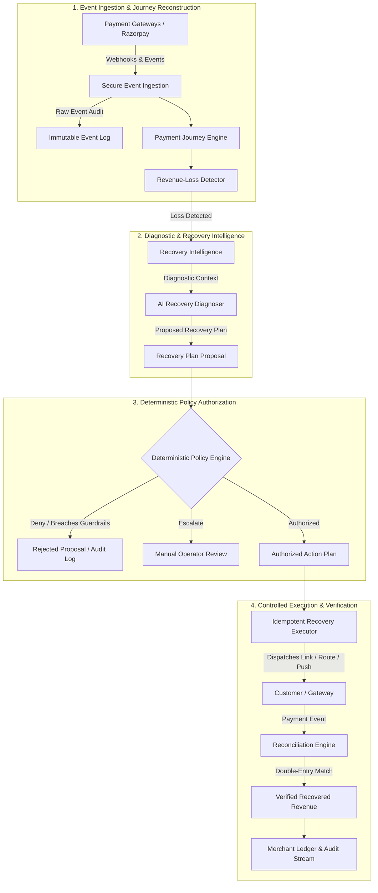

# RecoveryOS — Architecture Specification

## Architectural Invariant

The core architectural invariant of RecoveryOS is non-negotiable:

```
AI PROPOSES.
POLICY AUTHORIZES.
INFRASTRUCTURE EXECUTES.
LEDGER VERIFIES.
```

---

## Implemented Architecture vs Planned Architecture

### IMPLEMENTED NOW (Phase 0: Foundation, Phase 1: Domain Model, Phase 2: Persistence Layer)
- **Monorepo Structure**: Workspace with `@recoveryos/web` (Next.js 15) and `recoveryos-api` (FastAPI).
- **Domain Layer (`apps/api/app/domain`)**:
  - **Values**: `Money` (integer minor units, floats prohibited, currency-checked arithmetic), `Currency` (ISO-4217), `Confidence` (bounded 0..10000 bps), `PaymentFailure` taxonomy, `PolicyDecision` (`ALLOW`, `REVIEW`, `DENY`), `ProposalSource`.
  - **Entities & Aggregates**: `Order`, `Payment`, `RecoveryCase`, `RecoveryProposal`, `Policy`, `RecoveryAction`, `RecoveryOutcome`.
  - **State Machines**: Fully validated transition matrices and terminal state enforcement for Order, Payment, RecoveryCase, and RecoveryAction.
  - **Authorization Guardrail Invariant**: `RecoveryAction` cannot transition to `QUEUED` or `EXECUTING` without explicit `PolicyDecision.ALLOW`.
  - **Reconciliation Invariant**: `RecoveryOutcome` cannot be `VERIFIED` without non-empty evidence reference and verified timestamp.
  - **Domain Events**: Immutable frozen events for orders, payments, cases, proposals, actions, outcomes, and verifications.
- **Persistence Layer (`apps/api/app/infrastructure/persistence`)**:
  - **SQLAlchemy 2.x Declarative Models**: 10 tables reflecting domain schema with multi-tenant merchant isolation.
  - **Explicit Bidirectional Mappers**: Pure translation between domain dataclasses and ORM models; zero ORM leakage into domain.
  - **Tenant-Scoped Repository Ports & Adapters**: Repositories enforcing `merchant_id` boundary on all queries with zero auto-commit.
  - **Unit of Work Pattern**: `SqlAlchemyUnitOfWork` with transaction management and automatic rollback on error.
  - **Transactional Outbox & Audit Log**: Atomic persistence of `domain_events` and `outbox_messages` alongside aggregate mutations.
  - **Optimistic Concurrency Control (OCC)**: `version` column tracking and conflict rejection across mutable aggregates.
  - **Database Defense-in-Depth**: Alembic migration `0001_initial_financial_schema` with CHECK constraints and partial indexes.
- **Infrastructure**: Docker Compose managing PostgreSQL 16 Alpine and Redis 7 Alpine with health checks.
- **API Runtime**: FastAPI application with structured logging, Correlation ID tracking, and centralized exception handling.
- **Dependency Readiness**: Real-time `/health` (process liveness) and `/ready` (PostgreSQL + Redis connectivity checks with active fallback/recovery).
- **Database & Migrations**: SQLAlchemy 2.x async engine with `asyncpg` and Alembic migration harness connected to live PostgreSQL.
- **Frontend Console**: Operations shell with responsive layout, live system status polling, and honest placeholder views for future phases.
- **Quality & CI**: Full test suites (425 pytest + 7 vitest tests), static type checkers (strict mypy + tsc), formatters/linters (ruff + eslint), and GitHub Actions CI workflow.

### PLANNED (Phases 3 – 20)
- **Authentication & RBAC (Phase 3)**
- **Payment Journey Reconstruction Engine (Phase 7)**
- **Autonomous Recovery Intelligence (Phase 9)**
- **Deterministic Policy & Guardrail Engine (Phase 10)**
- **Razorpay Webhook & API Ingestion Layer (Phases 5 & 6)**
- **Double-Entry Financial Ledger & Reconciliation Engine (Phase 12)**

---

## Long-Term End-to-End Architecture Flow



---

## Component Boundaries & Data Contracts

| Component | Responsibility | Boundary Rule |
| :--- | :--- | :--- |
| **Domain Layer (`apps/api/app/domain`)** | Pure business entities, state machines, value objects, events. | Zero framework or persistence dependencies; strict financial invariants. |
| **API (`apps/api`)** | HTTP interface, health checks, webhook receiver, query APIs. | Stateless; communicates with PostgreSQL and Redis. |
| **Web (`apps/web`)** | Merchant operations console, real-time telemetry, policy configuration. | Typed client calling API; zero secret exposure. |
| **PostgreSQL** | Primary persistent store for events, journeys, policies, and ledger. | Accessed strictly via SQLAlchemy async sessions and Alembic. |
| **Redis** | High-throughput event caching, ephemeral state, distributed locking. | Accessed strictly via async Redis client with pre-ping validation. |
