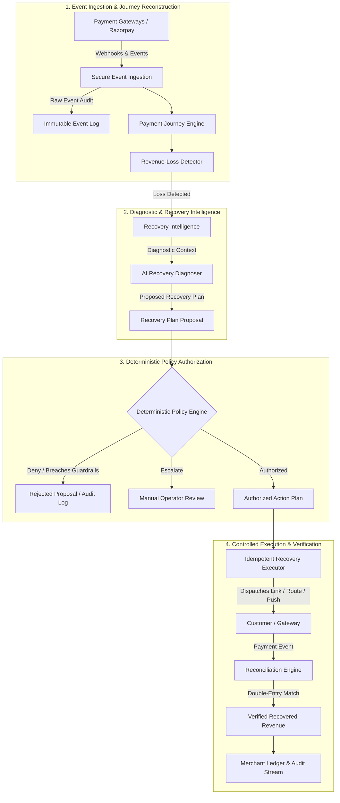

# RecoveryOS — Architecture Specification

## Architectural Invariant

The core architectural invariant of RecoveryOS is non-negotiable:

```
AI PROPOSES.
POLICY AUTHORIZES.
INFRASTRUCTURE EXECUTES.
LEDGER VERIFIES.
```

---

## Implemented Architecture vs Planned Architecture

### IMPLEMENTED NOW (Phase 0: Foundation)
- **Monorepo Structure**: Clean workspace with `@recoveryos/web` (Next.js 15) and `recoveryos-api` (FastAPI).
- **Infrastructure**: Docker Compose managing PostgreSQL 16 Alpine and Redis 7 Alpine with health checks.
- **API Runtime**: FastAPI application with structured logging, Correlation ID tracking, and centralized exception handling.
- **Dependency Readiness**: Real-time `/health` (process liveness) and `/ready` (PostgreSQL + Redis connectivity checks with active fallback/recovery).
- **Database & Migrations**: SQLAlchemy 2.x async engine with `asyncpg` and Alembic migration harness connected to live PostgreSQL.
- **Frontend Console**: Operations shell with responsive layout, live system status polling, and honest placeholder views for future phases.
- **Quality & CI**: Full test suites (pytest + vitest), static type checkers (mypy + tsc), formatters/linters (ruff + eslint), and GitHub Actions CI workflow.

### PLANNED (Phases 1 – 20)
- **Payment Journey Reconstruction Engine**
- **Autonomous Recovery Intelligence (LLM & Heuristics)**
- **Deterministic Policy & Guardrail Engine**
- **Razorpay Webhook & API Ingestion Layer**
- **Double-Entry Financial Ledger & Reconciliation Engine**

---

## Long-Term End-to-End Architecture Flow



---

## Component Boundaries & Data Contracts

| Component | Responsibility | Boundary Rule |
| :--- | :--- | :--- |
| **API (`apps/api`)** | HTTP interface, health checks, webhook receiver, query APIs. | Stateless; communicates with PostgreSQL and Redis. |
| **Web (`apps/web`)** | Merchant operations console, real-time telemetry, policy configuration. | Typed client calling API; zero secret exposure. |
| **PostgreSQL** | Primary persistent store for events, journeys, policies, and ledger. | Accessed strictly via SQLAlchemy async sessions and Alembic. |
| **Redis** | High-throughput event caching, ephemeral state, distributed locking. | Accessed strictly via async Redis client with pre-ping validation. |
