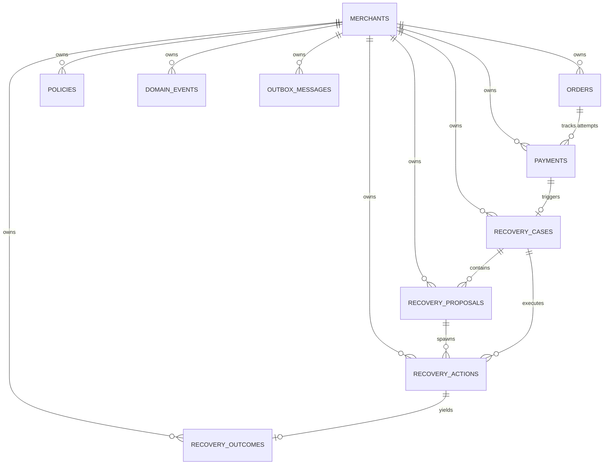

# RecoveryOS — Database & Persistence Specification

## Architectural Invariant & Persistence Philosophy

```
AI PROPOSES.
POLICY AUTHORIZES.
INFRASTRUCTURE EXECUTES.
LEDGER VERIFIES.
```

The frozen financial domain layer (`apps/api/app/domain`) is the **sole business truth**.
PostgreSQL stores that truth. SQLAlchemy adapts to the domain; the domain never adapts to SQLAlchemy.

---

## 1. Relational Schema & Tables

All primary keys use string identifiers (`String(64)` / UUIDs). Monetary amounts are strictly stored as 64-bit integers (`BigInteger`) representing minor units (e.g., paisa / cents) — floating-point numbers are prohibited across the entire schema.



### Table Inventory (10 Tables)

1. **`merchants`**: Tenant entity model representing merchant boundaries (`id`, `name`, `slug`, `created_at`, `updated_at`).
2. **`orders`**: Commercial checkout orders (`id`, `merchant_id`, `amount_minor`, `currency`, `status`, `external_reference`, `created_at`, `updated_at`, `version`).
3. **`payments`**: Payment attempts against orders (`id`, `merchant_id`, `order_id`, `amount_minor`, `currency`, `state`, `attempt_number`, `provider_reference`, failure context fields, `created_at`, `updated_at`, `version`).
4. **`recovery_cases`**: Recovery case aggregate (`id`, `merchant_id`, `payment_id`, `amount_at_risk_minor`, `currency`, `state`, `opened_at`, `updated_at`, `attempt_count`, `terminal_reason`, failure context fields, `version`).
5. **`recovery_proposals`**: Advisory diagnostic proposals (`id`, `merchant_id`, `recovery_case_id`, `strategy`, `rationale`, `confidence_bps`, `source`, `created_at`).
6. **`policies`**: Merchant authorization guardrails (`id`, `merchant_id`, `enabled`, `max_retry_attempts`, `cooldown_seconds`, `auto_action_amount_limit_minor`, `review_required_above_minor`, `currency`, `allowed_strategies`, `created_at`, `updated_at`, `version`).
7. **`recovery_actions`**: Authorized actionable recovery executions (`id`, `merchant_id`, `recovery_case_id`, `strategy`, `state`, `authorization_decision`, `authorization_reference`, `attempt_number`, `failure_reason`, `created_at`, `updated_at`, `version`).
8. **`recovery_outcomes`**: Observed recovery outcomes and verification state (`id`, `merchant_id`, `recovery_case_id`, `recovery_action_id`, `status`, `amount_recovered_minor`, `currency`, `observed_at`, `verification_status`, `verification_reference`, `verified_at`).
9. **`domain_events`**: Append-only transactional audit log of immutable domain events (`event_id`, `merchant_id`, `aggregate_type`, `aggregate_id`, `event_type`, `occurred_at`, `payload`, `recorded_at`).
10. **`outbox_messages`**: Transactional outbox persistence foundation for asynchronous message dispatching (`id`, `event_id`, `merchant_id`, `event_type`, `payload`, `occurred_at`, `created_at`, `published_at`, `attempt_count`).

---

## 2. Multi-Tenant Merchant Isolation & Structural DB Integrity

Every operational table contains a non-nullable `merchant_id`.

- **Repository Scoping**: Every repository interface and query requires an explicit `merchant_id` filter.
- **Physical Database Enforcement**: Multi-tenant relational integrity is structurally enforced via composite unique constraints and composite foreign keys:
  - `payments(order_id, merchant_id) -> orders(id, merchant_id)`
  - `recovery_cases(payment_id, merchant_id) -> payments(id, merchant_id)`
  - `recovery_proposals(recovery_case_id, merchant_id) -> recovery_cases(id, merchant_id)`
  - `recovery_actions(recovery_case_id, merchant_id) -> recovery_cases(id, merchant_id)`
  - `recovery_outcomes(recovery_case_id, merchant_id) -> recovery_cases(id, merchant_id)`
  - `recovery_outcomes(recovery_action_id, merchant_id) -> recovery_actions(id, merchant_id)`
- Any direct SQL attempt to create cross-tenant relationships (e.g. linking Merchant B's payment to Merchant A's order) is rejected immediately at the PostgreSQL foreign key level.

---

## 3. Financial Integrity & Database-Level Constraints

Defense-in-depth CHECK constraints are enforced on all financial tables:

| Entity | Constraint | Description |
| :--- | :--- | :--- |
| **`orders`** | `ck_orders_amount_positive` | `amount_minor > 0` |
| **`payments`** | `ck_payments_amount_positive` | `amount_minor > 0` |
| **`payments`** | `ck_payments_attempt_positive` | `attempt_number >= 1` |
| **`recovery_cases`** | `ck_recovery_cases_amount_positive` | `amount_at_risk_minor > 0` |
| **`recovery_cases`** | `ck_recovery_cases_attempt_non_negative` | `attempt_count >= 0` |
| **`recovery_cases`** | `uq_active_recovery_case_per_payment` | Partial unique index on `payment_id` for non-terminal states |
| **`recovery_proposals`** | `ck_recovery_proposals_confidence_bps_range` | `confidence_bps >= 0 AND confidence_bps <= 10000` |
| **`policies`** | `ck_policies_max_retries_non_negative` | `max_retry_attempts >= 0` |
| **`policies`** | `ck_policies_cooldown_non_negative` | `cooldown_seconds >= 0` |
| **`policies`** | `ck_policies_auto_limit_non_negative` | `auto_action_amount_limit_minor >= 0` |
| **`policies`** | `ck_policies_review_limit_non_negative` | `review_required_above_minor >= 0` |
| **`policies`** | `ck_policies_auto_limit_le_review_limit` | `auto_action_amount_limit_minor <= review_required_above_minor` |
| **`recovery_actions`** | `ck_recovery_actions_attempt_positive` | `attempt_number >= 1` |
| **`recovery_actions`** | `ck_recovery_actions_executable_must_be_allowed` | Executable states (`QUEUED`, `EXECUTING`) strictly require `COALESCE(authorization_decision, '') = 'ALLOW'` |
| **`recovery_outcomes`** | `ck_recovery_outcomes_amount_non_negative` | `amount_recovered_minor >= 0` |
| **`recovery_outcomes`** | `ck_recovery_outcomes_verified_requires_evidence` | `VERIFIED` status strictly requires `verification_reference IS NOT NULL`, `verified_at IS NOT NULL`, and `status = 'RECOVERY_OBSERVED'` |

---

## 4. Single Source of Truth for Recovered Revenue

RecoveryOS strictly distinguishes:
```
ACTION SUCCESS != RECOVERY OBSERVED != VERIFIED RECOVERED REVENUE
```
- `recovery_cases` stores `amount_at_risk_minor` (target amount lost).
- `recovery_outcomes` is the **sole authoritative source of truth** for observed and verified recovered revenue (`amount_recovered_minor`, `verification_status`, `verification_reference`, `verified_at`).
- No duplicate recovered revenue amounts are maintained on `recovery_cases`.

---

## 5. Optimistic Concurrency Control (OCC)

Mutable financial aggregates (`orders`, `payments`, `recovery_cases`, `recovery_actions`, `policies`) use an integer `version` column:

1. Aggregate is loaded with its current `version`.
2. Repositories update with conditional predicate `WHERE id = :id AND merchant_id = :merchant_id AND version = :current_version`.
3. If concurrent modification occurs (`rowcount == 0`), an explicit `ConcurrencyError` is raised.

---

## 6. Unit of Work & Transactional Outbox Foundation

The Unit of Work pattern (`apps/api/app/infrastructure/persistence/unit_of_work.py`) manages transactions and event persistence:

1. **Transaction Lifecycle**:
   - Commits are owned exclusively by `UnitOfWork.commit()`.
   - Repositories contain zero commit calls.
   - Exceptions trigger automatic rollback.
2. **Transactional Outbox Foundation**:
   - Domain events tracked during the transaction are written to both `domain_events` (immutable audit log) and `outbox_messages` (pending dispatch table) in the **exact same database transaction** as the aggregate mutations.
   - Note: Phase 2 establishes the **persistence foundation** for outbox storage. Outbox workers, queue dispatchers, and external consumers belong to subsequent phases.

---

## 7. Physical Database Separation & Test-Safety Invariant

To guarantee complete environmental isolation and protect persistent development data from destructive testing routines:

1. **Physical Separation**:
   - **Development Database**: `recoveryos` (`postgresql+asyncpg://...:5432/recoveryos`)
   - **Test Database**: `recoveryos_test` (`postgresql+asyncpg://...:5432/recoveryos_test`)
2. **Fail-Closed Destructive Guard**:
   - Destructive operations (such as migration downgrade/upgrade cycles or database truncation fixtures) must strictly assert:
     - `APP_ENV == "test"`
     - Target database name ends with `_test`
   - Any execution targeting `production`, `staging`, `development`, or any database not ending in `_test` raises an immediate `RuntimeError` and terminates.
