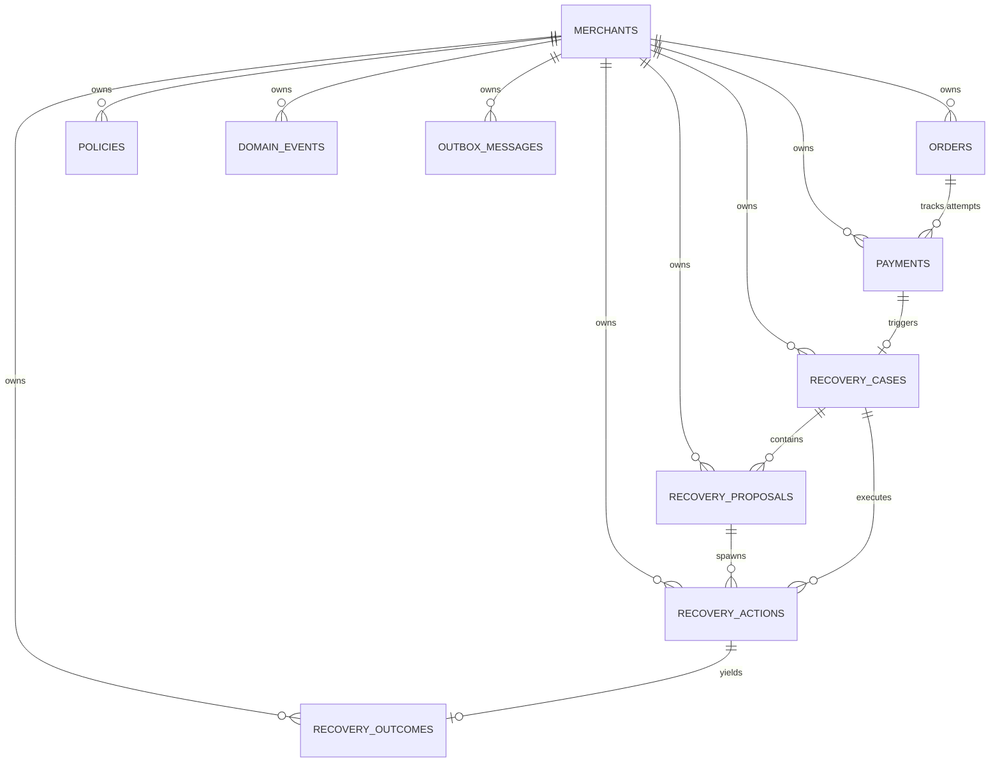

# RecoveryOS — Database & Persistence Specification

## Architectural Invariant & Persistence Philosophy

```
AI PROPOSES.
POLICY AUTHORIZES.
INFRASTRUCTURE EXECUTES.
LEDGER VERIFIES.
```

The frozen financial domain layer (`apps/api/app/domain`) is the **sole business truth**.
PostgreSQL stores that truth. SQLAlchemy adapts to the domain; the domain never adapts to SQLAlchemy.

---

## 1. Relational Schema & Tables

All primary keys use standard UUIDv4 identifiers (`uuid_pkg.UUID`). Monetary amounts are strictly stored as 64-bit integers (`BigInteger`) representing minor units (e.g., paisa / cents) — floating-point numbers are prohibited across the entire schema.



### Table Inventory

1. **`merchants`**: Registered merchant accounts.
2. **`orders`**: Commercial checkout orders. Tracks `amount_minor`, `currency`, `status`, and `version`.
3. **`payments`**: Payment attempts against orders. Tracks `amount_minor`, `currency`, `state`, failure reason, provider references, and `version`.
4. **`recovery_cases`**: Core revenue-recovery lifecycle aggregate for failed payments. Tracks `state`, target amounts, recovered amounts, and `version`.
5. **`recovery_proposals`**: AI/Rule-generated recovery strategy proposals with confidence score in basis points (0..10000 bps) and risk scores.
6. **`policies`**: Deterministic merchant guardrail and authorization rule definitions.
7. **`recovery_actions`**: Authorized actionable recovery executions (nudges, links, retries). Tracks `state`, execution timestamps, provider references, and `version`.
8. **`recovery_outcomes`**: Verified financial reconciliation outcomes with mandatory evidence references.
9. **`domain_events`**: Append-only audit log of all domain events emitted during state transitions.
10. **`outbox_messages`**: Transactional outbox table for reliable at-least-once message delivery to downstream consumers/workers.

---

## 2. Multi-Tenant Merchant Isolation

Every operational table includes a non-nullable `merchant_id UUID NOT NULL REFERENCES merchants(id) ON DELETE RESTRICT`.

- **Repository Scoping**: Every repository query filters explicitly by `merchant_id` in addition to entity `id`.
- **Database-Level Defense**: Foreign key relationships on merchant-owned entities use composite constraints or direct merchant verification to prevent cross-tenant entity linkage.
- **Partial Unique Indexes**: Enforce tenant-scoped uniqueness (e.g., only one active recovery case per payment per merchant).

---

## 3. Financial Integrity & Database-Level Constraints

To provide defense-in-depth against invalid data states, PostgreSQL CHECK constraints are enforced on all critical columns:

| Entity | Constraint | Description |
| :--- | :--- | :--- |
| **`orders`** | `ck_orders_amount_positive` | `amount_minor > 0` |
| **`payments`** | `ck_payments_amount_positive` | `amount_minor > 0` |
| **`recovery_cases`** | `ck_cases_amount_positive` | `amount_minor > 0` |
| **`recovery_proposals`** | `ck_proposals_confidence_bps` | `confidence_bps >= 0 AND confidence_bps <= 10000` |
| **`recovery_proposals`** | `ck_proposals_risk_score` | `risk_score >= 0.0 AND risk_score <= 1.0` |
| **`policies`** | `ck_policies_max_discount_bps` | `max_discount_bps >= 0 AND max_discount_bps <= 10000` |
| **`policies`** | `ck_policies_min_confidence_bps` | `min_confidence_bps >= 0 AND min_confidence_bps <= 10000` |
| **`recovery_actions`** | `ck_actions_execution_attempt` | `execution_attempt >= 0` |
| **`recovery_outcomes`** | `ck_outcomes_recovered_non_negative` | `recovered_amount_minor >= 0` |
| **`recovery_outcomes`** | `ck_outcomes_verified_requires_evidence` | Enforces that `VERIFIED` outcomes have non-empty `evidence_reference` and `verified_at`. |

---

## 4. Optimistic Concurrency Control (OCC)

Mutable financial aggregates (`orders`, `payments`, `recovery_cases`, `recovery_actions`) use an integer `version` column:

1. When an aggregate is loaded, its current `version` is read.
2. During persistence updates, the SQL query executes an atomic conditional update:
   ```sql
   UPDATE table_name
   SET ..., version = version + 1
   WHERE id = :id AND merchant_id = :merchant_id AND version = :current_version;
   ```
3. If `cursor.rowcount == 0`, a concurrent modification occurred. The repository immediately raises a `ConcurrencyError`.

---

## 5. Unit of Work & Transactional Outbox

The Unit of Work pattern (`apps/api/app/infrastructure/persistence/unit_of_work.py`) guarantees atomic business transactions:

1. **Transaction Lifecycle**:
   - Manages an async SQLAlchemy session.
   - Automatically rolls back on uncaught exceptions.
   - Repositories do **not** auto-commit.
2. **Atomic Outbox & Audit**:
   - As domain aggregates perform operations, they emit domain events.
   - The Unit of Work collects these events and persists them to both `domain_events` (immutable audit log) and `outbox_messages` (pending dispatch) within the **exact same database transaction** as the aggregate state changes.
   - Ensures zero event loss and eliminates distributed two-phase commit overhead.
