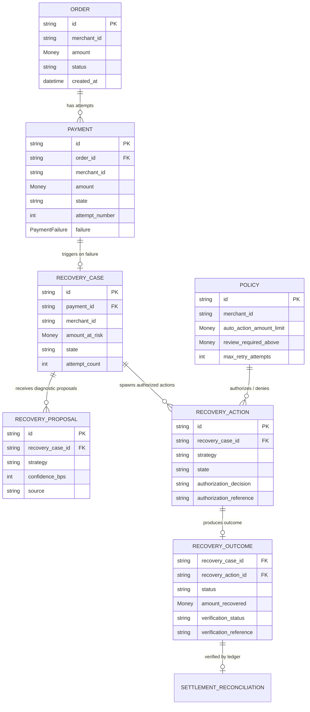

# RecoveryOS Domain Model

## 1. Core Philosophy & Invariant

RecoveryOS is an enterprise payment reliability and autonomous revenue recovery control plane.

```
AI PROPOSES. POLICY AUTHORIZES. INFRASTRUCTURE EXECUTES. LEDGER VERIFIES.
```

The domain model is **provider-independent** (no PSP-specific assumptions in domain contracts) and **persistence-independent** (pure domain entities and value objects isolated from database tables or ORM models).

---

## 2. Ubiquitous Language

| Term | Domain Meaning |
| :--- | :--- |
| **Order** | The commercial checkout transaction initiated by a customer for goods/services. |
| **Payment** | A distinct financial attempt to capture funds for an order. Multiple attempts may exist per order. |
| **Payment Failure** | Structured domain taxonomy (`FailureCategory`, code, reason, retryability) classifying the decline. |
| **RecoveryCase** | A discrete unit of lost revenue undergoing automated investigation and recovery. |
| **RecoveryProposal** | Advisory recommendation generated by AI, statistical models, rules, or operators. **Never executes directly.** |
| **Policy** | Deterministic merchant guardrails, retry budgets, cooldown windows, and amount ceilings. |
| **PolicyDecision** | `ALLOW` (authorized for execution), `REVIEW` (escalated to human), `DENY` (prohibited). |
| **RecoveryAction** | An authorized, executable remediation unit (e.g. smart retry, payment link). |
| **RecoveryOutcome** | The observed operational and financial result of an action. |
| **Verified Revenue** | Revenue confirmed via double-entry ledger reconciliation against settlement/bank evidence. |

---

## 3. Financial Invariants

1. **Integer Minor Units**: All monetary values are represented as `Money` with integer `amount_minor` (paise, cents). Floating-point arithmetic and boolean coercion are strictly prohibited.
2. **Currency Consistency**: Arithmetic and comparisons across mismatching currencies raise `CurrencyMismatchError`.
3. **Timezone Awareness**: All financial timestamps are strictly timezone-aware UTC. Naive datetimes raise `InvalidTimestampError`.
4. **Proposal $\neq$ Authorization**: An AI or rule proposal (`RecoveryProposal`) holds zero authority to execute. Actions must obtain explicit authorization (`PolicyDecision.ALLOW`) before entering `QUEUED` or `EXECUTING`.
5. **Action Succeeded $\neq$ Revenue Recovered $\neq$ Verified Revenue**: A succeeded HTTP call or webhook does not constitute recovered revenue until observed, and is not verified until matched against settlement payout evidence.

---

## 4. Entity Relationship Diagram


