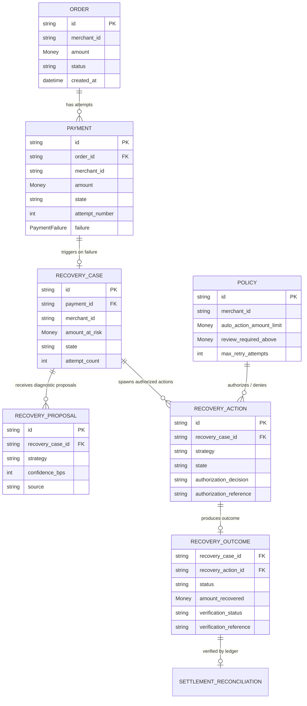

# RecoveryOS Domain Model

## 1. Core Philosophy & Invariant

RecoveryOS is an enterprise payment reliability and autonomous revenue recovery control plane.

```
AI PROPOSES. POLICY AUTHORIZES. INFRASTRUCTURE EXECUTES. LEDGER VERIFIES.
```

The domain model is strictly **provider-independent** (no PSP-specific SDKs or naming in domain contracts) and **persistence-independent** (pure Python dataclasses and value objects isolated from database tables, ORM models, and migrations).

---

## 2. Ubiquitous Language

| Term | Domain Meaning |
| :--- | :--- |
| **Order** | The commercial checkout transaction initiated by a customer for goods/services. |
| **Payment** | A distinct financial attempt to capture funds for an order. Multiple attempts may exist per order. |
| **Payment Failure** | Structured domain taxonomy (`FailureCategory`, code, reason, retryability) classifying payment declines. |
| **RecoveryCase** | A discrete unit of lost revenue undergoing automated investigation and recovery across its lifecycle. |
| **RecoveryProposal** | Advisory diagnostic recommendation generated by AI, statistical models, rules, or operators. **Never executes directly.** |
| **Policy** | Deterministic merchant guardrails, retry budgets, cooldown windows, and amount ceilings. |
| **PolicyDecision** | `ALLOW` (authorized for automated execution), `REVIEW` (requires human review), `DENY` (strictly prohibited). |
| **RecoveryAction** | An authorized, executable remediation unit (e.g. smart retry, payment link). Enforces authorization guardrail. |
| **RecoveryOutcome** | The observed operational result and reconciliation verification state of an action. |
| **Recovery Observed** | Telemetry or gateway event indicating payment capture has occurred, prior to settlement verification. |
| **Verified Revenue** | Revenue confirmed via double-entry settlement/ledger evidence matching the recovered transaction. |

---

## 3. Financial Invariants & Verification Boundaries

1. **Integer Minor Units**: All monetary values are represented as `Money` with integer `amount_minor` (paise, cents). Floating-point arithmetic and boolean coercion are strictly prohibited. Signed money is supported for accounting adjustments (`allow_negative=True`), while business aggregates (`Order.amount`, `Payment.amount`, `RecoveryCase.amount_at_risk`) mandate positive amounts.
2. **Currency Consistency**: Arithmetic and comparisons across disparate currencies raise `CurrencyMismatchError`.
3. **Timezone Awareness**: All financial timestamps are strictly timezone-aware and normalized to UTC. Naive datetimes raise `InvalidTimestampError`.
4. **Proposal $\neq$ Authorization**: An AI or rule proposal (`RecoveryProposal`) holds zero authority to execute. Actions must obtain explicit authorization (`PolicyDecision.ALLOW`) before entering `QUEUED` or `EXECUTING`.
5. **Action Succeeded $\neq$ Recovery Observed $\neq$ Verified Recovered Revenue**:
   - `RecoveryAction.SUCCEEDED` indicates technical execution succeeded.
   - `OutcomeStatus.RECOVERY_OBSERVED` indicates customer/gateway reported capture.
   - `VerificationStatus.VERIFIED` requires explicit settlement evidence reference (`verification_reference`) and verified timestamp.
6. **Deep Event Immutability**: All domain events recursively freeze payloads (mapping proxies, tuples) to prevent runtime mutation of historical facts.

---

## 4. Entity Relationship Diagram


