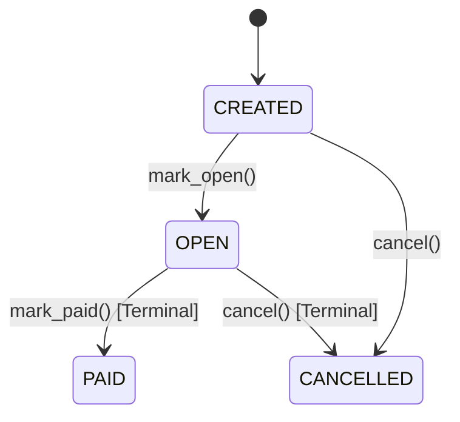
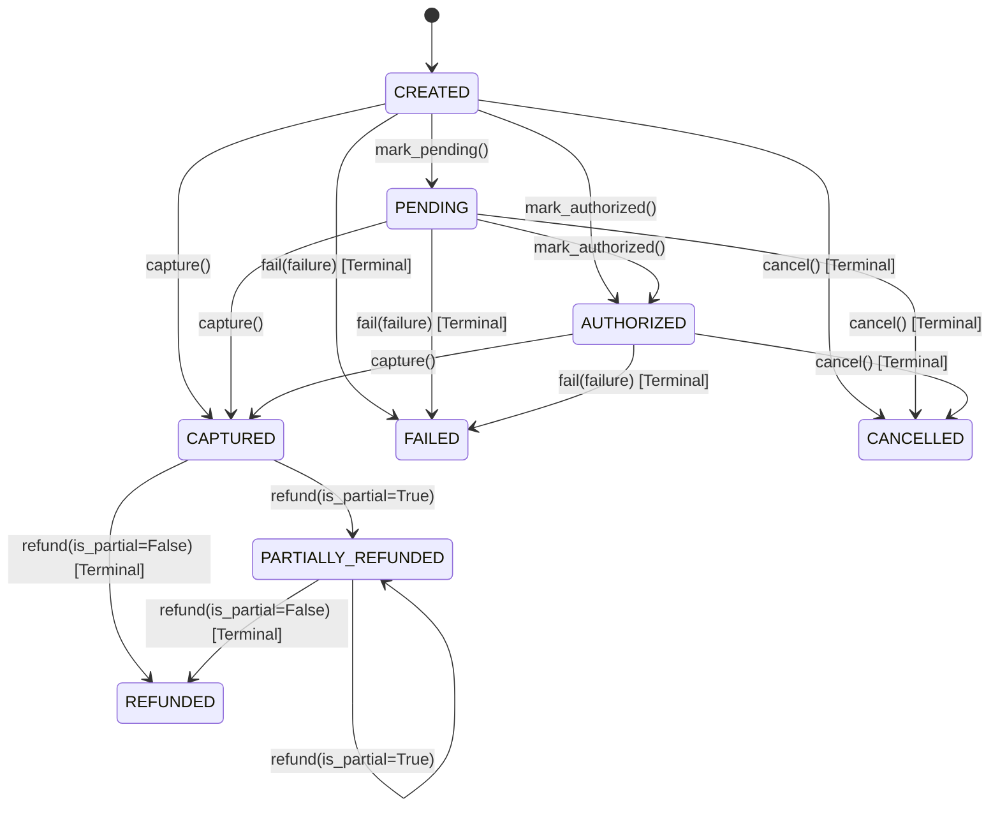
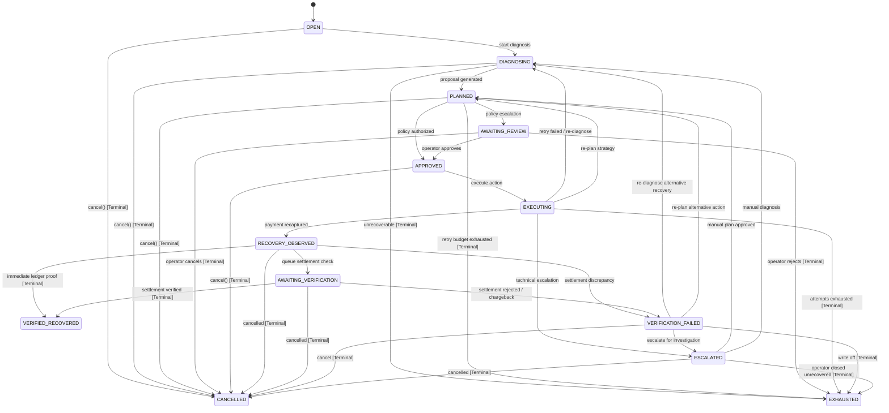
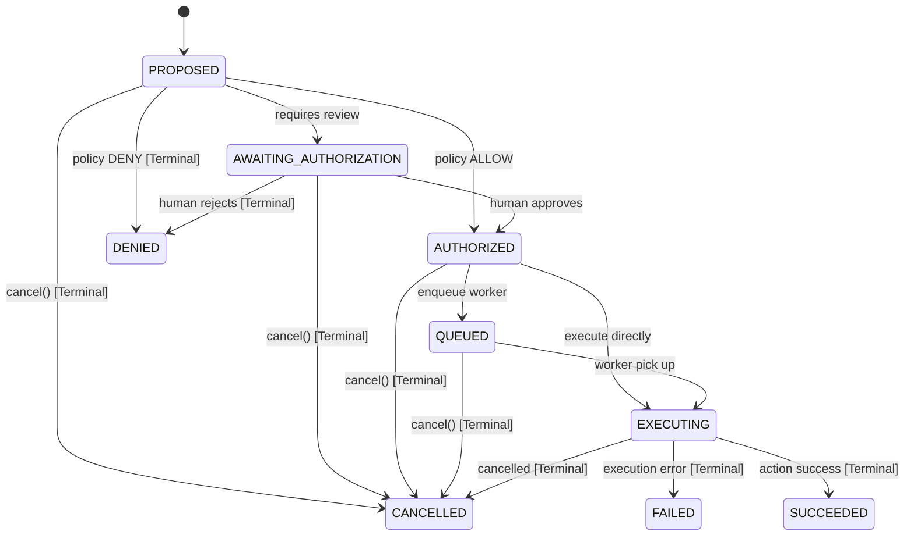

# RecoveryOS State Machines

All domain aggregates enforce deterministic state transition matrices. Attempting an unregistered transition raises `InvalidStateTransitionError`, and attempting mutation from a terminal state raises `TerminalStateError`.

---

## 1. Order State Machine

### Order Transition Matrix (4 states, 16 pairs)
| From State | Allowed Target States | Terminal? |
| :--- | :--- | :---: |
| `CREATED` | `OPEN`, `CANCELLED` | No |
| `OPEN` | `PAID`, `CANCELLED` | No |
| `PAID` | *(None)* | **Yes** |
| `CANCELLED` | *(None)* | **Yes** |

---

## 2. Payment State Machine

### Payment Transition Matrix (8 states, 64 pairs)
- Terminal states: `FAILED`, `CANCELLED`, `REFUNDED`.
- Invariants: `CAPTURED` clears active failure context; transition to `FAILED` attaches `PaymentFailure`.

---

## 3. RecoveryCase State Machine & Verification Lifecycle

### RecoveryCase Transition Matrix (13 states, 169 pairs)
- Terminal states: `VERIFIED_RECOVERED`, `EXHAUSTED`, `CANCELLED`.
- Verification failure handling: `VERIFICATION_FAILED` allows re-diagnosing, planning alternative strategies, escalating to operators, or marking exhausted.

---

## 4. RecoveryAction State Machine & Authorization Guardrail

### RecoveryAction Transition Matrix (9 states, 81 pairs)
- Terminal states: `DENIED`, `SUCCEEDED`, `FAILED`, `CANCELLED`.
- **Authorization Guardrail Invariant**: An action **cannot** be initialized in or transition to `QUEUED` or `EXECUTING` without explicit authorization (`authorization_decision == PolicyDecision.ALLOW`). Attempting to bypass authorization raises `UnauthorizedActionTransitionError`.
