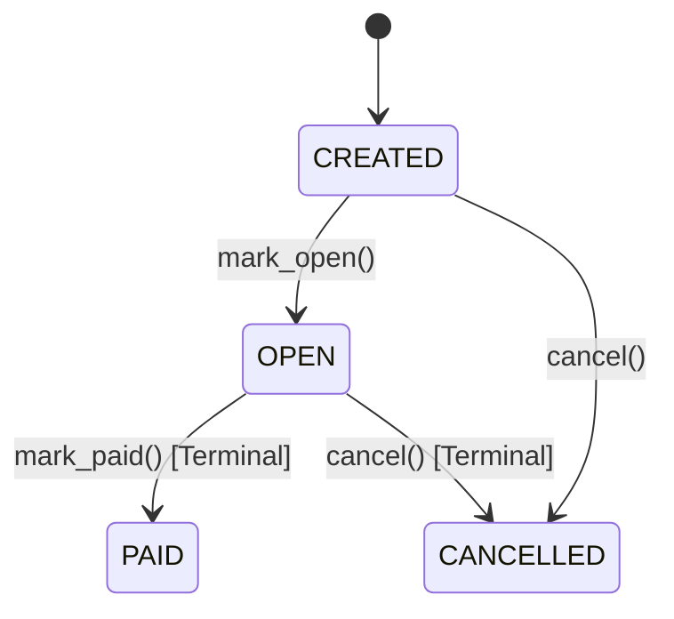
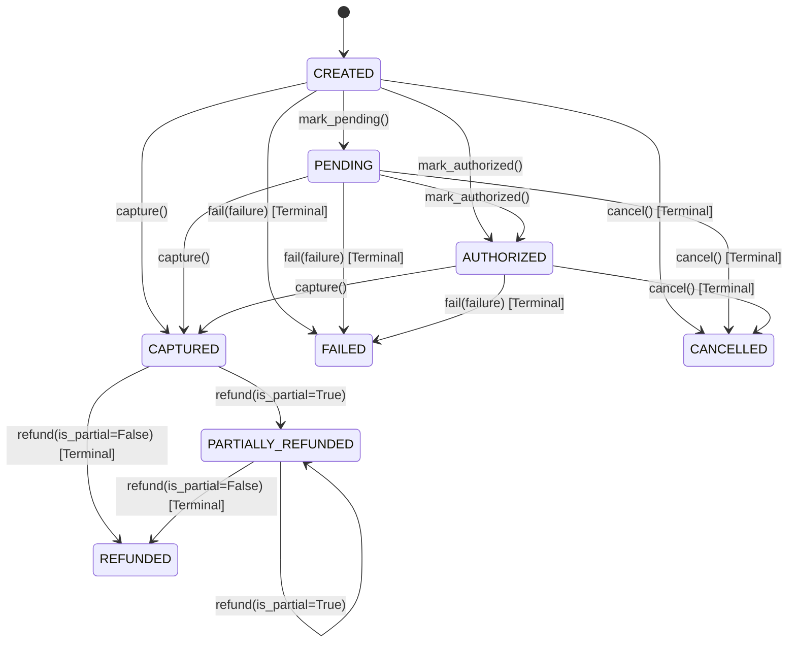
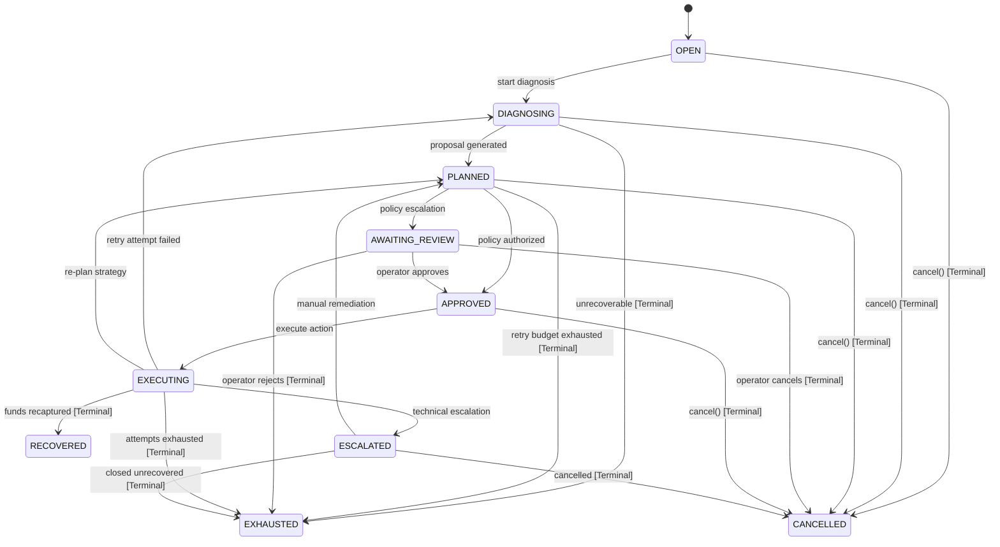
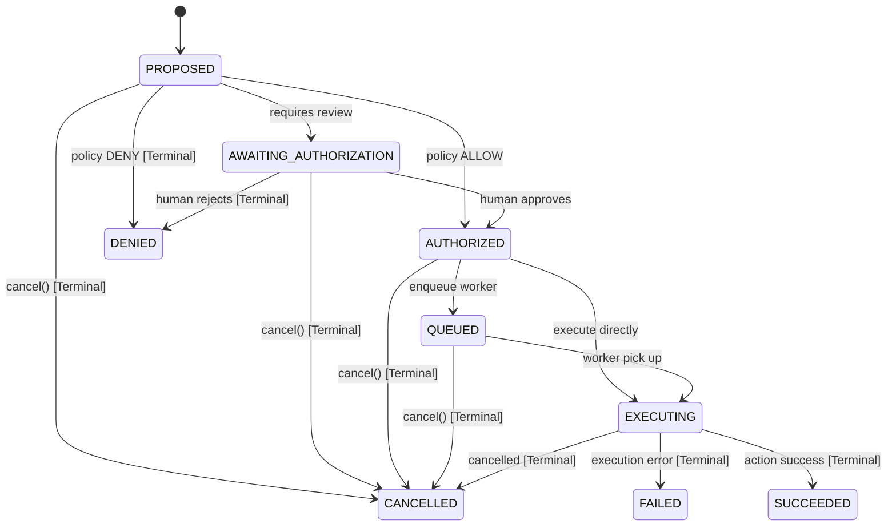

# RecoveryOS State Machines

All domain aggregates enforce deterministic state transition matrices. Attempting an unregistered transition raises `InvalidStateTransitionError`, and attempting mutation from a terminal state raises `TerminalStateError`.

---

## 1. Order State Machine

### Order Transition Matrix
| From State | Allowed Target States | Terminal? |
| :--- | :--- | :---: |
| `CREATED` | `OPEN`, `CANCELLED` | No |
| `OPEN` | `PAID`, `CANCELLED` | No |
| `PAID` | *(None)* | **Yes** |
| `CANCELLED` | *(None)* | **Yes** |

---

## 2. Payment State Machine

---

## 3. RecoveryCase State Machine

---

## 4. RecoveryAction State Machine & Authorization Guardrail

### Authorization Invariant
An action **cannot** transition to `QUEUED` or `EXECUTING` without explicit authorization (`authorization_decision == PolicyDecision.ALLOW`). Attempting to bypass authorization raises `UnauthorizedActionTransitionError`.
